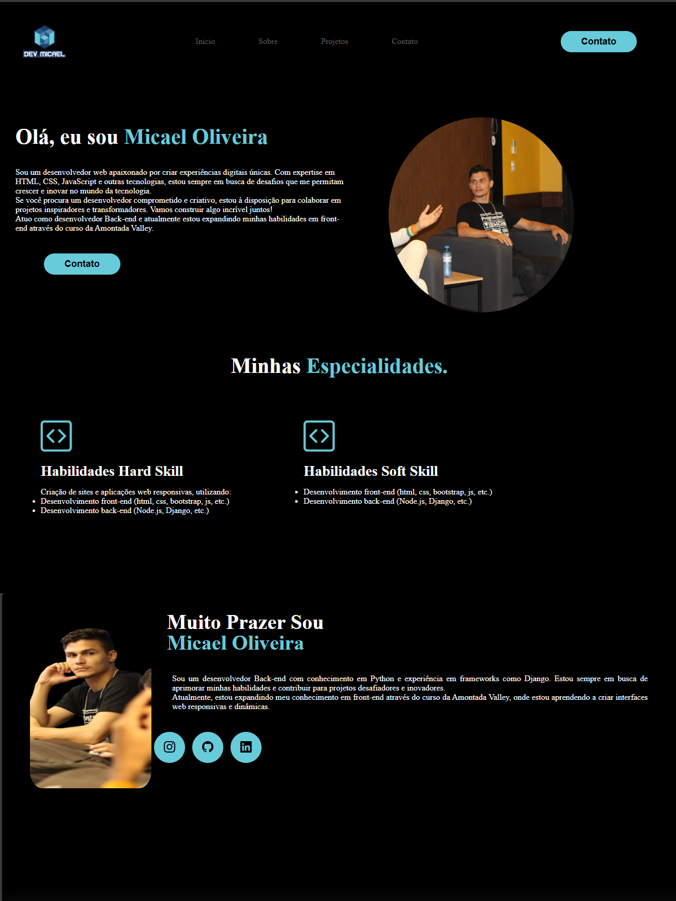

💼 Portfólio Pessoal

Este é o repositório do meu portfólio, desenvolvido com HTML e CSS puro. Um site simples, responsivo e focado em apresentar meus projetos e habilidades de forma clara.

🛠 Tecnologias utilizadas

HTML5

CSS3

Sem frameworks, bibliotecas ou JavaScript — tudo feito do zero, na mão.

📸 Preview

<!-- markdownlint-capture -->

📁 Estrutura do projeto

## 💻 Como visualizar localmente

1. Clone o repositório:

git clone https://github.com/MikaelOliver/Portifolio.git
cd portifolio

Abra o arquivo index.html no navegador.
Você pode dar dois cliques nele ou usar uma extensão como o Live Server no VSCode para ver com recarregamento automático.

✨ O que tem no site?
✅ Layout responsivo (funciona em celular, tablet e desktop)

✅ Seção sobre mim

✅ Galeria de projetos

✅ Contato com links para redes sociais

✅ Design limpo e moderno

